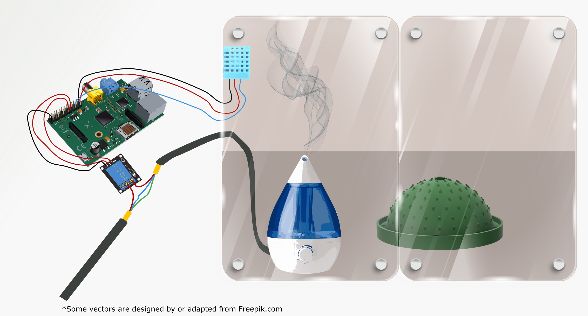

# Dewpal Software

## Humidity controller 
### Hardware components
* Raspberry Pi
* Combined humidity and temperature sensor (DHT22)
* 1 channel 5V relay board
* Humidifier

### Software
* __bangBangController.py__ implements a multithread controller for the system discussed above.

* __DHTxx.py__ provides hardware/software interfaces for the humidity sensors using adafruit software.

* __DHTlog__ is a simple HTML page displaying the humidity and temperature.

* __binInput.py__ reads a pseudorandom binary input signal (CSV) which is applied to the humidityStat for system identification.
